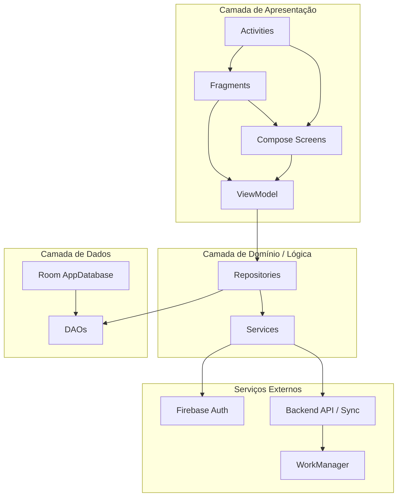
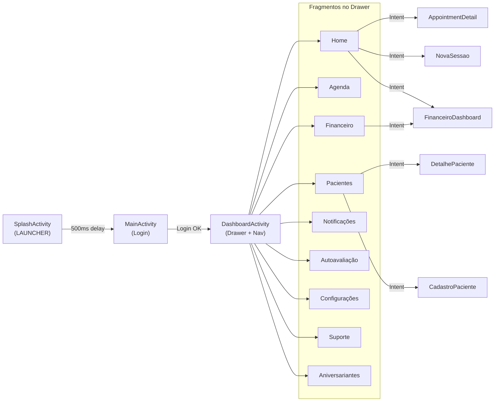
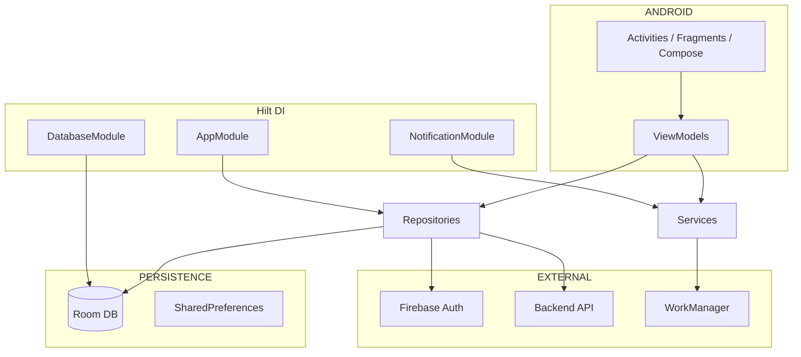

# Diagrama Simplificado da Arquitetura - Psipro

## Visão geral do fluxo de telas

```
┌──────────────────┐     ┌──────────────────┐     ┌──────────────────┐
│  SplashActivity  │ ──► │   MainActivity   │ ──► │ DashboardActivity │
│   (LAUNCHER)     │     │  (Login Firebase)│     │  (host principal) │
└──────────────────┘     └──────────────────┘     └────────┬─────────┘
                                   │                        │
                                   │                        │ NavHostFragment
                                   ▼                        │ (nav_graph.xml)
                          ┌─────────────────┐               │
                          │CreateAccountAct. │               ▼
                          │PasswordRecovery  │     ┌─────────────────────────┐
                          └─────────────────┘     │      Fragmentos          │
                                                  │  Home | Agenda | Pacientes│
                                                  │  Financeiro | Notificações│
                                                  │  Autoavaliação | Config   │
                                                  │  Suporte | Aniversariantes│
                                                  └────────────┬─────────────┘
                                                               │
                                    ┌──────────────────────────┼──────────────────────────┐
                                    │                          │                          │
                                    ▼                          ▼                          ▼
                          ┌──────────────────┐      ┌──────────────────┐      ┌──────────────────┐
                          │Activities internas│      │FinanceiroDashboard│      │ PatientListAct.  │
                          │ AppointmentDetail│      │     Activity      │      │ DetalhePaciente  │
                          │ NovaSessaoAct.    │      │                   │      │ CadastroPaciente │
                          └──────────────────┘      └──────────────────┘      └──────────────────┘
```

---

## Diagrama de camadas (arquitetura)



---

## Fluxo de navegação principal



---

## Camadas e responsabilidades

| Camada | Componentes | Responsabilidade |
|--------|-------------|------------------|
| **App** | `App.kt` | Inicialização, Hilt, Firebase, tema |
| **UI - Activity** | Splash, Main, Dashboard, +30 Activities | Entry points, navegação, host de fragmentos |
| **UI - Fragment** | 9 fragmentos no `nav_graph` | Telas principais do drawer/menu |
| **UI - Compose** | Screens em `ui/screens/`, `ui/compose/` | Telas compostas por Jetpack Compose |
| **ViewModel** | `viewmodel/` e `ui/viewmodels/` | Estado, lógica de apresentação |
| **Repository** | `data/repository/`, `data/repositories/` | Acesso unificado a fontes de dados |
| **Data** | Room `AppDatabase`, DAOs, Entities | Persistência local SQLite |
| **Services** | `notification/`, `auth/`, `sync/`, `backup/` | Notificações, autenticação, sincronização |
| **DI** | Hilt (`di/`, `@HiltAndroidApp`) | Injeção de dependências |

---

## Diagrama simplificado de dependências



---

## Resumo estrutural

- **Padrão:** MVVM com Repository
- **DI:** Hilt (Dagger)
- **Navegação:** Navigation Component + Intents
- **UI:** Mistura de Views (XML) e Jetpack Compose
- **Dados:** Room (local) + Firebase Auth + Backend sync via WorkManager
- **Notificações:** Vários serviços (Appointment, Agendamento, Cobrança, Financeiro, Autoavaliação)
